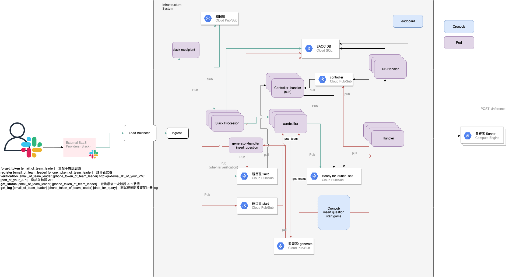

# Detore

Detore is an API scoring system, which allows people who want to build a Machine Learning API competition to use this system to establish a complete set of mechanisms for contestant identity authentication, API server authentication, and API request issuance.

## Requirements

This system needs to use Google Cloud Platform related components to complete the construction. Contains GKE, cloud logging, GCS, etc.
Front end uses slack as user interface.

## Prerequisites

- GCP uses the service account json file of the relevant component
- Prepare a slack workspace and add a slack app
- Create Pub/Sub topics
  - generator-{env}
  - controller-{env}
  - lake-{env}
  - sea-{env}
  - slack-msg-{env}

## System Structure



## Contact

- [Twitter](https://x.com/detore_AI)

## Getting Started

0. Initialize a GKE cluster, cloudSQL.
1. Go to each folder Detore build dockerfile, and push to the corresponding Container Registry.

```
cd Detore/<each component name>
docker build -t <Container Registry>/<image name>/
```

2. Place the json file and related parameters in chart/Values.yml
3. Go to chart/

```
helm install ai-arena .
```
